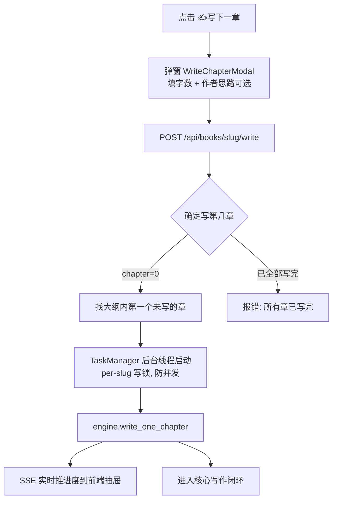
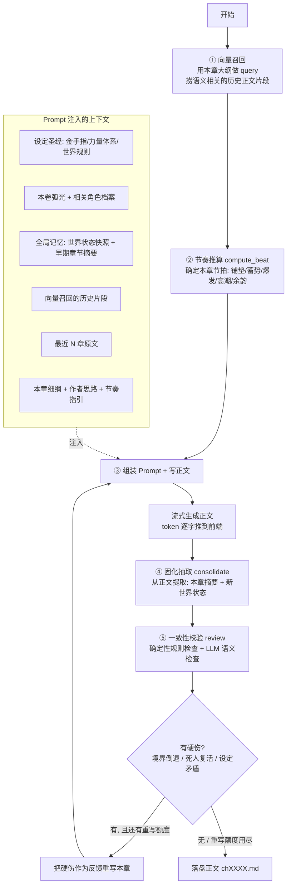
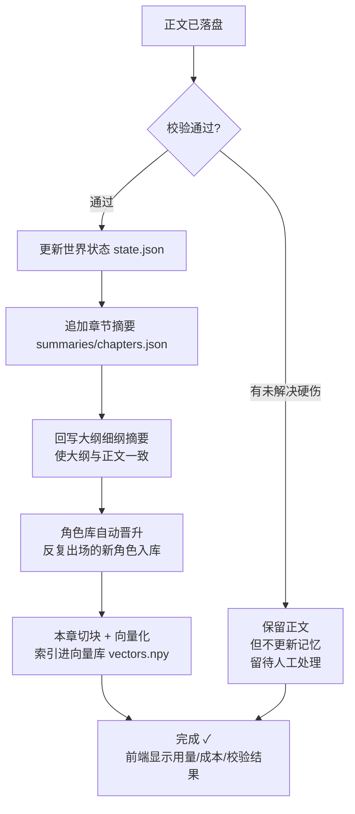

# 写一章的完整流程（写下一章 / 批量续写）

本文档说明：在前端点击「✍ 写下一章」（或「⏩ 批量续写」）后，系统会经过哪些流程、执行哪些功能，最终产出该章节的正文。

> 实现入口：前端 `WriteChapterModal` → `POST /api/books/{slug}/write` → `engine.write_one_chapter()` → `generate/chapter_writer.py`。
> CLI `novel write` 与 Web 共用同一套 `engine.write_one_chapter`。

---

## 一、整体入口流程



---

## 二、核心写作闭环（engine 内部）



---

## 三、落盘后的记忆固化



---

## 四、一句话串联

```
点按钮 → 选字数/写思路 → 后台起任务
  → 召回历史 → 算节奏 → 组装上下文写正文（流式）
  → 抽取摘要+状态 → 校验 →（有硬伤就带反馈重写）
  → 落盘 → 更新三层记忆 + 大纲 + 角色库 + 向量库 → 完成
```

---

## 五、关键设计点

1. **三道"智能"环节**：向量召回（语义找相关历史）、一致性校验（揪硬伤）、自动重写（带反馈修正）——保证长篇连贯的核心。

2. **关键保护**：若重写后仍有硬伤，**正文保留但记忆不更新**，保持上一章的干净状态，防止错误状态污染后续章节。

3. **作者思路**：弹窗里填的思路是**高优先级**注入，可压过原细纲，但仍受设定圣经与世界状态约束（不会因一句话就让死人复活、境界倒退）。

4. **全程 SSE**：每一步实时推送到前端进度抽屉，正文可逐字（流式）查看。

5. **批量续写**：`run` 对一批章节循环执行上述同一套闭环，逐章顺序生成；进度面板连续展示每章过程，直到全部写完才结束。

6. **上下文参数可配**：召回条数、近章数、摘要条数等均可在配置页调整（详见配置页 / `.env` 的 `CTX_*`）。
